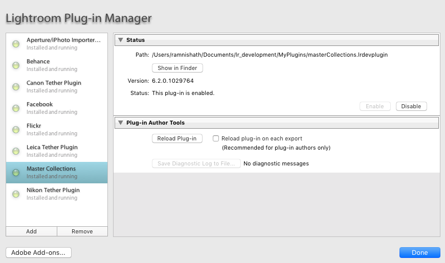
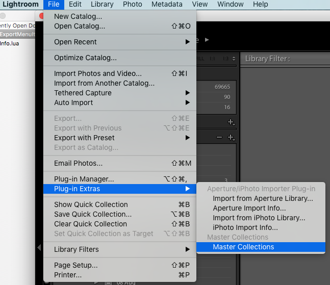
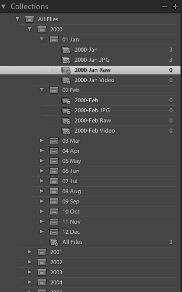

# LR Plugin - Master Collections
Light Room Plugin for creating Collections grouped by Year

## Installation steps

- Download the project files into a folder and re-name the folder with a suffix of .lrplugin; for example, masterCollections.lrplugin.
- Open the Light Room (LR) application and go to the Plugin Manager. 
  - Click 'Add' button. 
  - On the next window open the above mentioned folder/file (.lrplugin folder will appear as a file in MAC). Final view will look like below, click Done.

## Plugin in Action

- Go to File -> Plug-in Extras and then select 'Master Collections'.

- This will create a folder named 'All Files' under the Collections. It will also create a set of collection sets and smart collections as shown below.

More smart collections can be in corporated into this plugin, see source files for more details.

This plugin can be executed multiple times. Please note that already existing collections will not be updated. 
As of now the script creates collections till 2016.

Log file 'smartCollections.log' will be stored under 'Documents' folder.

The plugin has been tested using Light Room 5 in Mac OS X El Capitan.

### Future Enhancements

- When the plugin is executed, refresh the collections till the end of the current month of the year
- Customisable and configurable smart collections

